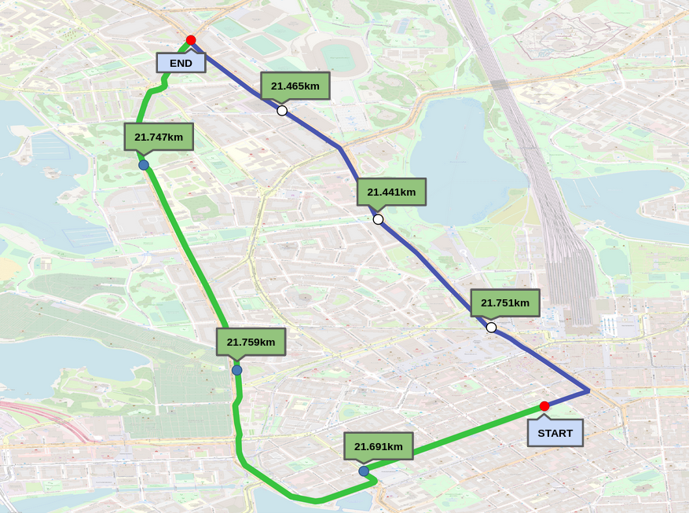

# VentureWithAir
# Haze-Ard

## Required modules
* DOWNTOWM data from VentureWithAir website
* python 3.6
* matplotlib 2.0.2
* basemap
* geopandas
* netcdf4 

## Image

## Contributing
* Rajshekar Reddy - rajashekar.reddy@research.iiit.ac.in
* Jayati Narang - jayati.narang@students.iiit.ac.in
* Siddharth De - siddharth.de@students.iiit.ac.in
* Sara Spanddhana - spanddhana.sara@research.iiit.ac.in
