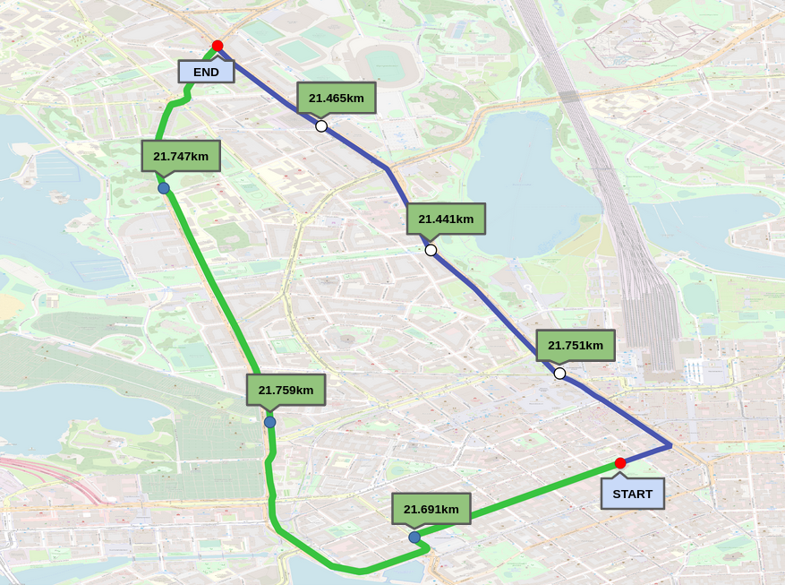

# Haze-Ard : VentureWithAir
Data Set used :
DOWNTOWN_20x20m_7d.nc4

|Specification | Description |
| :--- | ---|
|Size 	         | 222 MB							|
|Grid resolution |	20 x 20 meters (approx.)				|
|Bounding box 	 |(60.161, 24.922) to (60.176, 24.949)				|
|Time range 	 |2020-06-01 to 2020-06-07 (7 days)				|	
|Description 	 |Simulated measurements and upscaled meteorological data for downtown Helsinki during one week.	|

## Required modules
* DOWNTOWM data from VentureWithAir website
* python 3.6
* matplotlib 2.0.2
* basemap
* geopandas
* netcdf4 

## Image
Due to not much variation in air quality, the visibility of all paths is good and is around 21km.
So, both paths are safe in case of visibility.

## Contributing
* Rajshekar Reddy - rajashekar.reddy@research.iiit.ac.in
* Jayati Narang - jayati.narang@students.iiit.ac.in
* Siddharth De - siddharth.de@students.iiit.ac.in
* Sara Spanddhana - spanddhana.sara@research.iiit.ac.in
